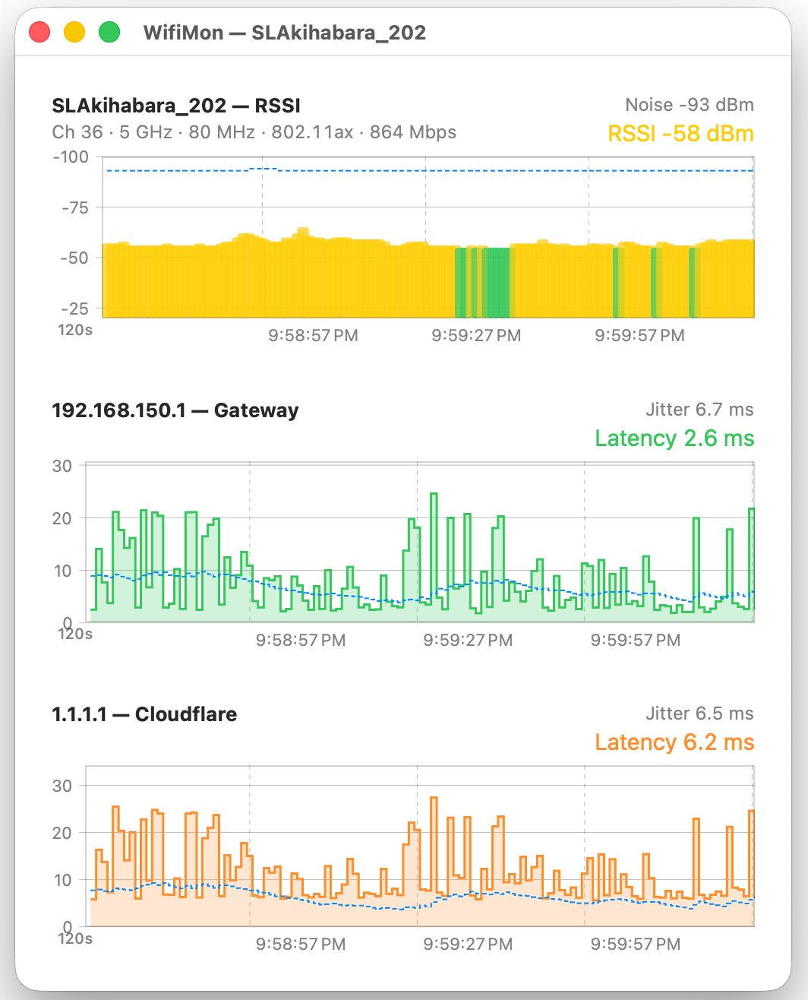

# WiFi Monitor for macOS

Monitors RSSI (signal strength) and noise level in dBm.

Also runs ping to the local gateway and Cloudflare IP address `1.1.1.1` so you can determine if the problem is with Wi-Fi or "internet connection".

